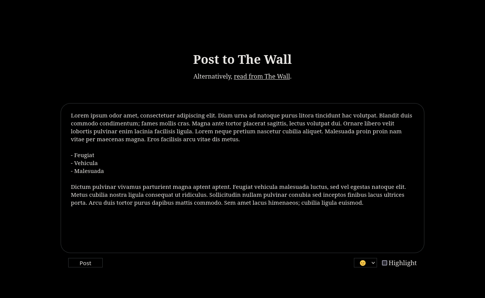
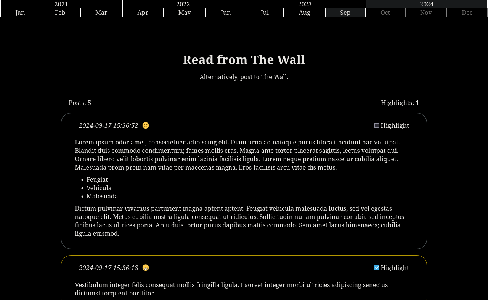

# The Wall

**The Wall** is a user-friendly web-based service designed to facilitate self-documentation. Its straightforward interface features a login, post, and read page, and offers a seamless platform for users to express themselves and share their thoughts. The concept is refreshingly simple: users can write and publish posts about any topic they desire, at any time they wish. Whether it's personal reflections, creative ideas, or simply sharing experiences, The Wall provides a space for individuals to freely express themselves.


## Improvements

This is the fourth iteration of **The Wall**, with new functionality, features and removed complexity. It features:

- Simple application structure and decreased dependancies.
- Server-side rendering to require minimal javascript.
- Database logic using Sqlite instead of external SQL-server.
- Feature for tracking ones mood over time.
- Feature for highlighting important posts.
- Increased usability, security, performance and improved error-handling.
- Easy installation and maintainability with docker and docker-compose.




## Installation

### Podman (recommended)

These instructions assume `wget` and `podman` v5+ are installed.

``` bash
wget 'https://github.com/coder0x6675/thewall/raw/refs/heads/main/thewall.container' -O "$(systemd-path user-configuration)/containers/systemd/thewall.container"
systemctl --user daemon-reload
systemctl --user start thewall
```

### Docker

These instructions assume `git`, `docker`, and `docker-compose` are installed.

``` bash
git clone 'https://github.com/coder0x6675/thewall.git'
cd thewall
docker-compose up -d
```

## Usage

The service is running on port 3000 as default. On the first run you will have to set a new password.

If you would like to change the password, log in to The Wall and manually navigate to `/reset` to enter a new password.

If you forgot your password, delete the file `data/auth.sha512` and restart the container.

To back up the database, simply copy the file `data/thewall.db` to a location of your choice.

